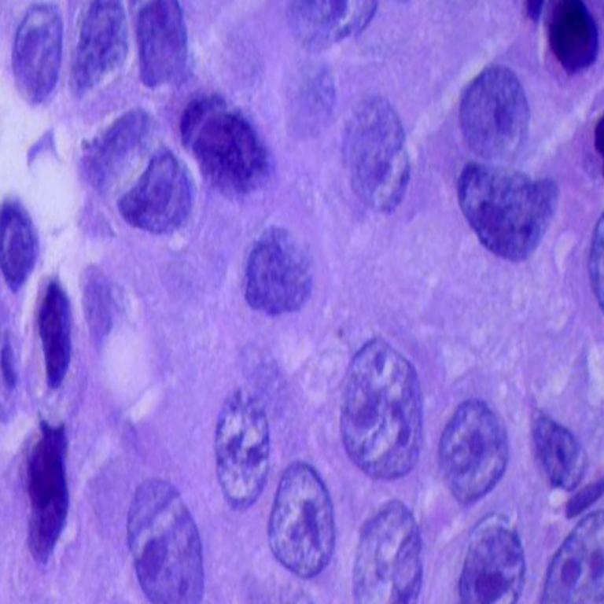

# HistoScope

HistoScope is a machine learning web application for automated classification of lung and colon histopathology images. It uses a four-stage cascade of binary convolutional neural networks (CNNs) to provide a final diagnostic label.



## Table of Contents

- [Overview](#overview)
- [Model Architecture](#model-architecture)
- [Features](#features)
- [Technologies Used](#technologies-used)
- [Installation](#installation)
- [Usage](#usage)
- [Web Application](#web-application)
- [Training](#training)
- [Project Structure](#project-structure)
- [Deployment](#deployment)
- [Contributing](#contributing)
- [License](#license)
- [Disclaimer](#disclaimer)

## Overview

HistoScope accepts an RGB histopathology image and classifies it through a sequential cascade of binary models:

1. **Organ** — Lung or Colon
2. **Disease State** — Benign or Malignant
3. **Cancer Type** — Adenocarcinoma (ACA) or Squamous Cell Carcinoma (SCC) for malignant lung cases

The final prediction is one of:

- `Lung: Benign`
- `Lung: Malignant - ACA`
- `Lung: Malignant - SCC`
- `Colon: Benign`
- `Colon: Malignant`

A separate lightweight CNN detector first checks whether the uploaded image appears to be a histopathology image. Non-histopathology images are rejected before the cascade runs.

## Model Architecture

```
Input Image (3 x 224 x 224)
        |
        v
CNN1: Lung vs Colon
        |
        +-- Lung --> CNN2: Benign vs Malignant
        |               |
        |               +-- Malignant --> CNN4: ACA vs SCC
        |               +-- Benign --> Final Label
        |
        +-- Colon --> CNN3: Benign vs Malignant
                        |
                        +-- Benign / Malignant --> Final Label
```

The cascade uses four small binary CNNs implemented in PyTorch. A fifth small CNN acts as a histopathology detector. All models load their weights from `checkpoint_files/` at startup.

## Features

- Four-stage interpretable classification cascade
- Web interface with drag-and-drop upload
- Random reference sample selection
- Histopathology image validation before inference
- Responsive mobile-first UI
- Retrained cascade checkpoints with improved validation error
- CLI demo available via `start.py`
- Cross-platform path handling

## Technologies Used

- Python
- PyTorch
- torchvision
- FastAPI
- Uvicorn
- Pillow
- HTML/CSS/JavaScript
- Cloudflare DNS
- Render

## Installation

### 1. Clone the repository

```bash
git clone https://github.com/swapguru/Lung-Colon-Cancer-Detection.git
cd Lung-Colon-Cancer-Detection
```

### 2. Create and activate a virtual environment

```bash
python -m venv .venv
source .venv/bin/activate        # Linux/macOS
.venv\Scripts\activate           # Windows
```

### 3. Install dependencies

```bash
pip install -r requirements.txt
```

### 4. Dataset setup

The full histopathology dataset is not included in the repository.

To fetch the dataset locally:

```bash
python scripts/fetch_datasets.py
```

This script downloads the Kaggle dataset and a negative non-histopathology dataset used for detector training.

For the web app random sample feature, the repository includes a small `dataset/demo/` folder with sample images.

## Usage

### Web Application

Start the FastAPI server locally:

```bash
uvicorn webapp.app:app --host 0.0.0.0 --port 8000
```

Open `http://127.0.0.1:8000`.

You can:

- Upload a histopathology image
- Select a random reference sample
- View the prediction and model confidence
- See the completed four-stage cascade

### Command Line Demo

Run:

```bash
python start.py
```

Then select a demo image:

```
Select one of the following options:
1. Demo Image 1 # Labeled as Lung - Malignant - SCC
2. Demo Image 2 # Labeled as Colon - Benign
3. Demo Image 3 # Labeled as Colon - Malignant
4. Demo Image 4 # Labeled as Lung - Benign
5. Demo Image 5 # Labeled as Lung - Malignant - ACA
```

Example output:

```
Predicted as Lung: Malignant - SCC
```

You can also pass a custom image:

```bash
python start.py --image /path/to/image.jpg
```

## Training

### Retrain the four cascade models

```bash
python train_cascade.py --tasks cnn1 cnn2 cnn3 cnn4 --epochs 30
```

This uses the improved training pipeline with:

- Data augmentation
- AdamW optimizer
- Class-balanced BCE loss
- Early stopping

Best checkpoints are saved under `checkpoint_files/` with `_best` suffix.

### Train the histopathology detector

```bash
python train_histopath_detector.py --epochs 20 --batch-size 64
```

The detector is trained on histopathology images and natural images from Caltech101.

## Project Structure

```
.
├── checkpoint_files/          # Best model checkpoints
├── dataset/
│   ├── demo/                  # Small set of demo images
│   └── lung_colon_image_set/  # Full dataset (not tracked)
├── models/
│   ├── CNN1_LungColon.py
│   ├── CNN2_LungClassifier.py
│   ├── CNN3_ColonClassifier.py
│   ├── CNN4_LungMalignant.py
│   ├── HistopathDetector.py
│   └── Multiclass_Classifier.py
├── utilities/
│   ├── data_utils.py
│   ├── evaluate_all.py
│   ├── predict_funcs.py
│   ├── train_net.py
│   └── utility_funcs.py
├── webapp/
│   ├── app.py
│   └── static/
│       ├── index.html
│       ├── style.css
│       ├── script.js
│       └── logo.svg
├── scripts/
│   └── fetch_datasets.py
├── start.py
├── train_cascade.py
├── train_histopath_detector.py
├── requirements.txt
└── render.yaml
```

## Deployment

HistoScope is deployable as a free Render web service with a custom Cloudflare subdomain.

### Render

- Render Blueprint configuration is provided in `render.yaml`.
- The service runs `uvicorn webapp.app:app`.
- Model checkpoints are loaded from the repository.

### Cloudflare

- Use a CNAME record pointing `histoscope` to the Render service URL.
- Set proxy status to **DNS only**.
- Add the custom domain in Render and let Render issue the SSL certificate.

## Contributing

Contributions are welcome. To contribute:

1. Fork the repository.
2. Create a feature branch.
3. Make your changes.
4. Submit a pull request.

## License

This project is licensed under the MIT License.

## Disclaimer

This project is for educational and research purposes only. It is not intended to replace professional medical diagnosis, treatment, or consultation. Always seek the advice of a qualified medical professional with any questions about a medical condition.